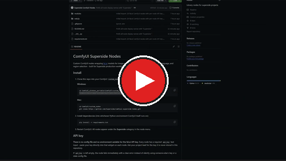

# ComfyUI Superside Nodes

Custom ComfyUI nodes wrapping [fal.ai](https://fal.ai) models for image editing, image-to-video, upscaling, vision/language, and region selection - built for Superside production workflows.

[](https://youtu.be/wcp9fhMJnXA)

## Install

1. Clone this repo into your ComfyUI `custom_nodes` directory.

   **Windows:**
   ```
   cd ComfyUI_windows_portable\ComfyUI\custom_nodes
   git clone https://github.com/Superside/comfyui-superside-nodes.git
   ```

   **Mac:**
   ```
   cd ComfyUI/custom_nodes
   git clone https://github.com/Superside/comfyui-superside-nodes.git
   ```

2. Install dependencies (into whichever Python environment ComfyUI itself runs on):
   ```
   pip install -r requirements.txt
   ```
3. Restart ComfyUI. All nodes appear under the **Superside** category in the node menu.

## API key

**There is no config file and the key is never stored in this repository.** Every node has an `api_key` text input - the normal flow is to paste your key directly into that widget on each node. Ask your project lead for the key.

**Opt-in `FAL_KEY` fallback:** if the `api_key` input is left blank, the node falls back to the `FAL_KEY` environment variable. This is for automated/headless deployments (e.g. a Replicate pipeline) that would otherwise have to embed the key as literal text inside the workflow JSON - where it can leak into request logs - and can instead pass it via a redacted env var. When a key is pasted into the input, the fallback never engages, so the manual flow is unchanged. If both are blank, the node fails immediately with a clear error.

> Only rely on the env fallback in **isolated, single-tenant** deployments where whoever can submit a workflow is trusted with the key. On a **shared multi-tenant** ComfyUI backend, keep passing an explicit per-workflow `api_key` - that input requirement is the access-control gate.

## Node reference

Every node's display name in ComfyUI's search/menu is prefixed with **"Superside "** (e.g. `Superside Seedream V5 Pro Edit`, `Superside Bria Background Standardizer`) - type "Superside" in the node search to see the whole set.

Nodes are grouped by task below. For every node: **Inputs** lists required inputs first, then optional ones (with defaults); **Outputs** lists the return values in order.

### Image editing & generation

#### Seedream V5 Pro Edit (`SupersideSeedreamV5ProEditNode`)
Grounded, region-precise editing with ByteDance Seedream V5 Pro - changes one element while keeping the rest of the frame intact. Up to 10 reference images.
- **Inputs:** `prompt`, `image_1`, `api_key` · optional: `image_2`-`image_10`, `size_mode` (preset/custom), `image_size` (preset, default `auto_2K`), `width`/`height` (custom mode), `output_format` (jpeg/png), `num_images` (1-6), `enable_safety_checker`, `sync_mode`
- **Outputs:** `images` (IMAGE), `info` (STRING - result URL)

#### Seedream V4.5 Edit (`SupersideSeedreamV45EditNode`)
Broader multi-reference editing (up to 10 images) with higher max resolution and multi-image output.
- **Inputs:** `prompt`, `image_1`, `api_key` · optional: `image_2`-`image_10`, `size_mode`, `image_size` (up to `auto_4K`), `width`/`height`, `num_images`, `max_images`, `seed` (-1 = random), `enable_safety_checker`, `sync_mode`
- **Outputs:** `images` (IMAGE), `info` (STRING)

#### Nano Banana Pro Edit (`SupersideNanoBananaProEditNode`)
Context-aware image editing, up to 6 reference images, up to 4K output.
- **Inputs:** `prompt`, `image_1`, `api_key` · optional: `image_2`-`image_6`, `num_images`, `aspect_ratio`, `output_format`, `resolution` (1K/2K/4K), `sync_mode`
- **Outputs:** `images` (IMAGE), `description` (STRING)

#### Nano Banana V2 Edit (`SupersideNanoBananaV2EditNode`)
Same family as Pro, with extra controls: seed, safety tolerance, web search grounding, reasoning depth.
- **Inputs:** `prompt`, `image_1`, `api_key` · optional: `image_2`-`image_6`, `num_images`, `seed`, `aspect_ratio`, `output_format`, `safety_tolerance`, `sync_mode`, `resolution` (0.5K-4K), `limit_generations`, `enable_web_search`, `thinking_level`
- **Outputs:** `images` (IMAGE), `description` (STRING)

#### GPT Image 2 Edit (`SupersideGPTImage2EditNode`)
OpenAI GPT Image 2 editing - mask-based inpainting, preset/aspect-ratio/custom sizing up to 4K. Uses fal's queued execution path internally (polls until complete).
- **Inputs:** `prompt`, `image_1`, `api_key` · optional: `image_2`-`image_6`, `mask_image`, `size_mode` (preset/aspect_ratio/custom), `image_size`, `aspect_ratio`, `resolution`, `width`/`height` (custom), `quality`, `num_images`, `output_format`, `sync_mode`
- **Outputs:** `images` (IMAGE), `info` (STRING)

#### Grok Imagine Image Quality Edit (`SupersideGrokImagineImageQualityEditNode`)
xAI Grok Imagine editing, up to 3 reference images, returns the model's revised prompt.
- **Inputs:** `prompt`, `image_1`, `api_key` · optional: `image_2`, `image_3`, `aspect_ratio`, `resolution` (1k/2k), `output_format`, `num_images`, `sync_mode`
- **Outputs:** `images` (IMAGE), `revised_prompt` (STRING)

#### Flux Kontext Max Multi-Image Node (`SupersideFluxKontextMaxMultiImageNode`)
FLUX.1 Kontext [Max] context-aware generation from up to 4 images.
- **Inputs:** `prompt`, `api_key` · optional: `image_1`-`image_4`, `seed`, `guidance_scale`, `num_images`, `safety_tolerance` (1-6), `output_format`, `aspect_ratio`
- **Outputs:** `IMAGE`

#### Juggernaut Flux Pro Image-to-Image (`SupersideJuggernautFluxProImg2ImgNode`)
High-realism image-to-image stylization.
- **Inputs:** `image`, `prompt`, `api_key` · optional: `strength`, `num_inference_steps`, `seed`, `guidance_scale`, `num_images`, `enable_safety_checker`
- **Outputs:** `IMAGE`

#### Wan 2.5 Image-to-Image (`SupersideWan25ImageToImageNode`)
Single or dual-reference editing with Wan 2.5.
- **Inputs:** `prompt`, `image_1`, `api_key` · optional: `image_2`, `negative_prompt`, `image_size`, `num_images` (1-4), `seed`
- **Outputs:** `IMAGE`

#### Image Retouch (`SupersideImageRetouchNode`)
One-click retouch/clean-up of an image (skin, blemishes, imperfections) using fal.ai's image-editing retouch model (`fal-ai/image-editing/retouch`). No prompt needed - just connect an image.
- **Inputs:** `image`, `api_key` · optional: `guidance_scale` (default 3.5), `num_inference_steps` (default 30), `lora_scale` (retouch strength, default 1.0), `seed` (-1 = random), `enable_safety_checker`, `sync_mode`
- **Outputs:** `image` (IMAGE), `info` (STRING - result URL)

### Background tools

There are three Bria background nodes - pick by what you actually want:

| Want… | Use | How |
|---|---|---|
| **Exact solid hex color** background, subject untouched | **Bria Background Standardizer (Hex Color)** | Deterministic: cut out subject + composite onto the exact color. No generative model, no quality drift, no invented shadows. |
| A **generated scene** background (studio, room, outdoors) | **Bria Replace Background V2** *or* **Bria Background Replace** | Prompt-driven, generative (re-lights the scene). Neither can produce an exact flat hex color, and both may subtly alter the subject. |

> Note: the two "Replace" nodes are *generative* - if you prompt them for a flat "#F2F2F1" background you'll get an approximate grey with a gradient/shadow, not the exact color, and the subject may change. For an exact catalogue-flat hex background, always use the **Standardizer**.

#### Bria Background Standardizer - Hex Color (`SupersideBriaBackgroundStandardizerNode`)
Cuts out the subject with Bria RMBG 2.0 (`fal-ai/bria/background/remove`) and composites it **locally** onto an exact solid hex color - no generative model touches the subject or the background pixels. Use this to batch-homogenize backgrounds (e.g. avatar sets, eCommerce catalogues) without any quality drift.
- **Inputs:** `image`, `hex_color` (e.g. `#F5F5F5`), `api_key` · optional: `edge_feather` (0-15px, softens the cutout edge), `sync_mode`
- **Outputs:** `image` (IMAGE), `info` (STRING - resolved hex + source cutout URL)

#### Bria Replace Background V2 (`SupersideBriaReplaceBackgroundNode`)
Prompt-driven background replacement with realistic lighting/perspective, using Bria's Replace Background V2 model (fal endpoint `bria/replace-background`). The simpler of the two generative replace nodes - text prompt only.
- **Inputs:** `image`, `prompt`, `api_key` · optional: `negative_prompt`, `steps_num`, `seed` (-1 = random), `sync_mode`
- **Outputs:** `image` (IMAGE), `info` (STRING - result URL)

#### Bria Background Replace (`SupersideBriaBackgroundReplaceNode`)
Bria's newer, richer generative background-replace model (fal endpoint `fal-ai/bria/background/replace`), separate from the V2 above. Adds reference-image guidance, prompt refinement, a fast/quality toggle, and multiple variations per run.
- **Inputs:** `image`, `prompt`, `api_key` · optional: `ref_image` (IMAGE - reference background to guide the look), `negative_prompt`, `num_images` (1-4), `refine_prompt` (default ON), `fast` (ON = faster, OFF = higher quality), `seed` (-1 = random), `sync_mode`
- **Outputs:** `image` (IMAGE), `info` (STRING - result URL)

### Video-to-video

#### Gemini Omni Flash Edit (`SupersideGeminiOmniFlashEditNode`)
Edit an existing video with a simple text instruction (e.g. "Make this video anime. Keep everything else the same.") using Google Gemini Omni Flash. Connect a `LoadVideo` node directly to `video` - the node uploads it to fal.ai internally, no manual URL needed. Uses fal's queued execution path internally (polls until complete). Not available for editing uploaded videos in the EEA, Switzerland, or the UK; voice editing and audio references are not supported.
- **Inputs:** `video` (VIDEO), `prompt`, `api_key`
- **Outputs:** `video` (VIDEO - connect directly to SaveVideo/PreviewVideo), `video_url` (STRING, direct fal.ai link)

### Image-to-video

#### Kling 2.1 Image-to-Video (`SupersideKling21ImageToVideoNode`)
Three quality tiers in one node.
- **Inputs:** `prompt`, `image`, `model_tier` (master/pro/standard), `api_key` · optional: `tail_image` (end-frame, Pro tier only), `duration` (5/10s), `negative_prompt`, `cfg_scale`
- **Outputs:** video URL (STRING)

#### Kling 2.5 Turbo Pro Image-to-Video (`SupersideKling25TurboProImageToVideoNode`)
Top-tier cinematic single-tier model, better motion fluidity than 2.1.
- **Inputs:** `prompt`, `image`, `api_key` · optional: `duration` (5/10s), `negative_prompt`, `cfg_scale`
- **Outputs:** video URL (STRING)

#### Seedance Lite Image-to-Video (`SupersideSeedanceLiteImageToVideoNode`)
Cost-efficient tier, up to 4 reference images.
- **Inputs:** `prompt`, `reference_image_1`, `api_key` · optional: `reference_image_2`-`4`, `aspect_ratio`, `resolution` (480p/720p), `duration`, `camera_fixed`, `seed`, `enable_safety_checker`
- **Outputs:** video URL (STRING)

#### Seedance Pro Image-to-Video (`SupersideSeedanceProImageToVideoNode`)
Higher quality tier, up to 1080p, with end-frame control.
- **Inputs:** `prompt`, `image`, `api_key` · optional: `end_image`, `aspect_ratio`, `resolution` (480p/720p/1080p), `duration`, `camera_fixed`, `seed`, `enable_safety_checker`
- **Outputs:** video URL (STRING)

#### Wan 2.5 Image-to-Video (`SupersideWan25ImageToVideoNode`)
Supports audio-driven video generation and prompt expansion.
- **Inputs:** `prompt`, `image`, `api_key` · optional: `audio_url` (WAV/MP3, 3-30s), `resolution` (480p/720p/1080p), `duration` (5/10s), `negative_prompt`, `enable_prompt_expansion`, `seed`
- **Outputs:** video URL (STRING)

### Upscaling

#### Ideogram Upscale (`SupersideIdeogramUpscaleNode`)
Prompt-guided upscaling with resemblance/detail sliders.
- **Inputs:** `image`, `api_key` · optional: `prompt`, `resemblance`, `detail`, `expand_prompt`, `seed`
- **Outputs:** `IMAGE`

#### PASD Upscaler Node (`SupersidePASDUpscalerNode`)
Pixel-aware stable diffusion super-resolution with ControlNet guidance and wavelet color correction.
- **Inputs:** `image`, `api_key` · optional: `scale`, `steps`, `guidance_scale`, `conditioning_scale`, `prompt`, `negative_prompt`
- **Outputs:** `IMAGE`

#### SeedVR2 Upscale Image (`SupersideSeedVR2UpscaleImageNode`)
Seamless upscaler with target-resolution or scale-factor mode.
- **Inputs:** `image`, `api_key` · optional: `upscale_mode` (target/factor), `upscale_factor`, `target_resolution` (720p-2160p), `seed`, `noise_scale`
- **Outputs:** `IMAGE`

#### SeedVR Upscale Video (`SupersideSeedVRUpscaleVideoNode`)
Video upscaling with temporal consistency. Connect a `LoadVideo` node directly to `video` - no manual URL needed.
- **Inputs:** `video` (VIDEO), `api_key` · optional: `upscale_factor`, `seed`
- **Outputs:** `video` (VIDEO - connect directly to SaveVideo/PreviewVideo), `video_url` (STRING, direct fal.ai link)

#### Topaz Upscale Image (`SupersideTopazUpscaleImageNode`)
10 Topaz model variants (Standard, CGI, High Fidelity, Recovery, Redefine, Wonder, etc.) with face enhancement, denoise, sharpen, and creative-recovery controls.
- **Inputs:** `image`, `api_key` · optional: `model` (10 variants), `upscale_factor`, `crop_to_fill`, `output_format`, `subject_detection`, `face_enhancement(+creativity/strength)`, `sharpen`, `denoise`, `fix_compression`, `strength`, `creativity`, `texture`, `prompt`, `autoprompt`, `detail`
- **Outputs:** `IMAGE`

### Vision & language

#### Any LLM Text (`SupersideAnyLLMTextNode`)
Text-only chat/completion across many models via OpenRouter on fal.ai (Gemini, Claude 4.6, GPT, Llama, Grok, Kimi).
- **Inputs:** `prompt`, `api_key` · optional: `system_prompt`, `model` (16 options, default `google/gemini-2.5-flash`), `reasoning`, `temperature`, `max_tokens`
- **Outputs:** `output` (STRING), `reasoning` (STRING)

#### Any LLM Vision (`SupersideAnyLLMVisionNode`)
Multi-image (up to 6) vision Q&A across many models, with auto-rescale for large images.
- **Inputs:** `prompt`, `api_key` · optional: `image_1`-`image_6`, `system_prompt`, `model` (21 options), `reasoning`, `priority` (latency/throughput), `auto_rescale_images`, `max_image_dimension`, `temperature`, `max_tokens`
- **Outputs:** `output` (STRING), `reasoning` (STRING)

#### Florence-2 Detailed Caption (`SupersideFlorence2CaptionNode`)
Fixed-purpose auto-caption generator (no prompt needed).
- **Inputs:** `image`, `api_key`
- **Outputs:** `STRING` (caption)

### Region selection

Both region selectors below share the same output contract, so they're interchangeable in downstream masking/inpainting workflows.

#### Florence-2 Smart Region Selector (`SupersideFlorence2RegionSelectorNode`)
Single-region selection (face/upper body/lower body/full body/custom object) using Florence-2 segmentation, with a grounding fallback.
- **Inputs:** `image`, `region_type`, `api_key` · optional: `custom_text` (only when `region_type=object`), `selection_mode` (largest/merge_all), `padding_percent`, `return_rect_mask`
- **Outputs:** `mask` (MASK), `mask_image` (IMAGE), `info` (STRING, JSON), `center_x`, `center_y`, `crop_width`, `crop_height` (INT)

#### SAM 3 Smart Region Selector (`SupersideSAM3RegionSelectorNode`)
Broader vocabulary than Florence (garments, vehicle parts, accessories) plus multi-mask/scoring modes.
- **Inputs:** `image`, `region_type` (19 presets incl. `object`), `api_key` · optional: `custom_text`, `selection_mode` (largest/first/merge_all), `padding_percent`, `return_rect_mask`, `return_multiple_masks`, `max_masks`, `include_scores`, `include_boxes`
- **Outputs:** `mask` (MASK), `mask_image` (IMAGE), `info` (STRING, JSON), `center_x`, `center_y`, `crop_width`, `crop_height` (INT)

### Product detail sheets

#### Smart Detail Sheet (`SupersideSmartDetailSheetNode`)
Finds the most visually interesting close-up details in a product photo, crops each one from the source photo, upscales the crops locally (Lanczos, no extra API call), and composites everything into one final image: the original photo plus the enlarged detail callouts - like a product spec sheet. Each crop is a fixed-size square centered on the detected detail's center point (not the model's raw bounding box edges), which keeps crops consistent and robust to imprecise or oddly-shaped boxes. Layout adapts to the original's aspect ratio (side column for portrait, row below for landscape/square), and the detail block is kept within a size range relative to the original so it's always legible without ever overwhelming the source photo. Crops that land on a flat/blank region (a missed detection) are automatically discarded.

Detection has two modes, picked via `product_category`:
- **auto** (default): a vision LLM (`model`) freely picks whichever `num_details` details look most interesting (textures, logos, hinges, pads, seams, materials, etc), returning JSON bounding boxes. Retries automatically if the model returns prose instead of JSON, a zero-size box, or overlapping/duplicate zones.
- **eyewear**: instead of leaving detection up to the LLM's free-form judgement (which in testing sometimes conflated distinct zones, e.g. placing "nose pad" and "hinge" on the same spot), this locates exactly 3 fixed zones - the nose pad, the hinge screw, and a temple tip - using Florence-2's grounding endpoint (a dedicated vision-grounding model, the same one behind `Florence-2 Smart Region Selector`), which proved far more spatially accurate for this task. Overrides `num_details` and `model`.

- **Inputs:** `image`, `api_key` · optional: `product_category` (auto/eyewear, default auto), `num_details` (1-6, default 3, ignored for eyewear), `detail_hint` (free text to steer the model, auto mode only), `crop_scale` (1-4x, default 2), `model` (gemini-2.5-flash/gemini-2.5-pro/gpt-4o/claude-sonnet-4.6, default gpt-4o, auto mode only), `crop_size_percent` (each crop's square size as a percent of the original's shorter side, default 35%)
- **Outputs:** `image` (IMAGE, the composited sheet), `info` (STRING, JSON with the kept details, discard count, and settings used)

#### Manual Detail Sheet (`SupersideManualDetailSheetNode`)
The manual counterpart to Smart Detail Sheet: instead of an AI choosing the detail crops, **you draw them yourself** on an interactive image preview built into the node. A row of numbered on/off buttons above the image turns each of up to 6 boxes on or off; every active box appears on the image, where you **drag it to move** and **scroll over it to resize**. Each box is a true 1:1 square (in image pixels). On run, the active boxes are cropped, upscaled locally (Lanczos), and composited alongside the original into the same product-spec-sheet layout as the Smart node (side column for portrait originals, row below for landscape/square). No AI detection and no API key - the node never leaves the machine. Boxes that land on a flat/blank area are discarded automatically.
- **Inputs:** `image` · optional: `crop_scale` (1-4x, default 2), `boxes` (internal - set by dragging on the preview; not meant to be edited by hand)
- **Outputs:** `image` (IMAGE, the composited sheet), `info` (STRING, JSON with the kept boxes, discard count, and crop scale)

The widget shows the exact image it received (including one produced by an upstream node like Normalize Product) after the first run, plus a live crop-preview thumbnail per active box so you can confirm each detail is inside its box before generating.

#### Normalize Product (`SupersideNormalizeProductNode`)
Places a catalogue product photo into a consistent frame so a fixed set of detail crops lands on the same spot across every SKU. It detects the product against the light catalogue background, then centers it with a fixed margin - so the product always occupies the same relative area, and fractional crop boxes (e.g. pre-positioned once in a Manual Detail Sheet per profile) stay aligned across the whole catalogue. In the default **keep resolution (pad)** mode it never downscales - it crops to the product and pads with the margin at native resolution, so there's no quality loss. No AI, no API key. Feed it into a Manual Detail Sheet whose boxes you've set once per profile (front / side / 3-4).
- **Inputs:** `image` · optional: `mode` (keep resolution (pad) / fixed canvas (scale), default keep resolution), `margin_percent` (default 8), `output_width` / `output_height` (fixed-canvas mode only, default 1024), `fit` (contain/width/height, fixed-canvas mode only), `background_hex` (empty = auto-match the photo's backdrop), `threshold` (product-vs-background sensitivity, default 12), `detect_pad_percent` (default 2)
- **Outputs:** `image` (IMAGE, normalized), `info` (STRING, JSON with the detected bbox, sizes, and settings used)

### Image utilities (no API key needed)

#### Resize (Long Side) (`SupersideResizeLongSideNode`)
Scales an image so its longest side hits a target size, preserving aspect ratio - handy for capping the biggest dimension of catalogue images before further processing.
- **Inputs:** `image`, `max_long_side` (default 2048) · optional: `only_downscale` (default ON - only shrink, never enlarge; OFF forces the long side to exactly the target), `resample` (lanczos/bicubic/bilinear/nearest, default lanczos)
- **Outputs:** `image` (IMAGE), `width` (INT), `height` (INT)

### Utility (no API key needed)

These nodes make no fal.ai calls, so they don't have an `api_key` input.

#### Prompt Box (`SupersidePromptBoxNode`)
A simple text box - write a prompt, connect the STRING output anywhere. Displays the text in the node UI.
- **Inputs:** `prompt`
- **Outputs:** `prompt` (STRING)

#### Prompt Splitter (`SupersidePromptSplitterNode`)
Splits one prompt into up to 10 separate STRING outputs using a separator symbol - useful for feeding individual prompts into multi-image nodes.
- **Inputs:** `prompt`, `separator` (default `*`)
- **Outputs:** `text_1` ... `text_10` (STRING)

## Package layout

```
comfyui-superside-nodes/
├── __init__.py                # Node registration (NODE_CLASS_MAPPINGS, etc.)
├── modules/
│   ├── base_node.py            # SupersideFalNode, ImageProcessingMixin, APIClientMixin, API_KEY_INPUT_SPEC
│   └── <35 node files>
├── web/js/show_text.js        # Read-only result-text display widget for select nodes
├── requirements.txt
└── README.md
```

## Architecture notes

- **`SupersideFalNode.get_client(api_key)`** builds a `fal_client.SyncClient(key=api_key)` scoped to that single call - no global environment mutation, so multiple nodes with different keys never interfere with each other.
- **`ImageProcessingMixin`** handles tensor→PNG upload and API-response→tensor conversion.
- **`VideoProcessingMixin`** does the same for ComfyUI's native VIDEO type (`comfy_api.latest.InputImpl.VideoFromFile`) - video nodes accept a `LoadVideo` output directly and return a VIDEO connectable to `SaveVideo`/`PreviewVideo`, with no manual URL copying required.
- **`APIClientMixin.call_api(client, endpoint, arguments)`** picks synchronous vs. queued execution automatically based on the endpoint - slow endpoints (GPT Image 2, Seedream V5 Pro/V4.5, Gemini Omni Flash) go through fal.ai's queue via `subscribe()` with a bounded client-side timeout, since a single long-held connection is prone to mid-flight disconnects on multi-minute generations; everything else uses the faster synchronous path.
- All nodes are registered under the **Superside** category.
